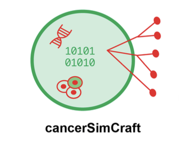
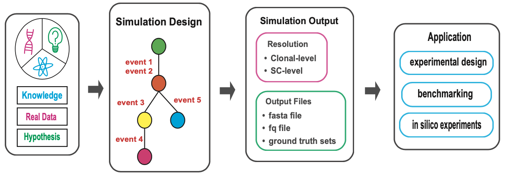
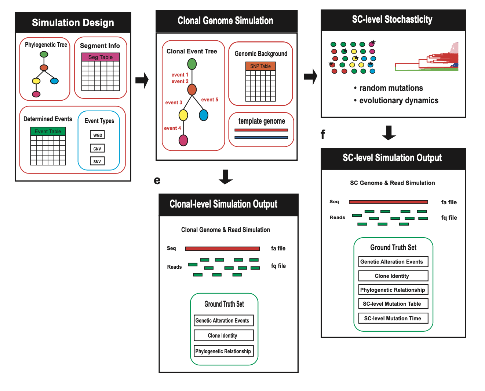

# cancerSimCraft 

<p align="center">
  
</p>


## Overview
`cancerSimCraft` is a powerful and flexible R package designed to simulate realistic cancer genomes at both clonal and single-cell resolution. It integrates deterministic rules with stochastic processes to model complex genomic events, including copy number variations (CNVs), single nucleotide variants (SNVs), and whole genome duplications (WGDs). By combining biological knowledge, real cancer genome data, and user-defined hypotheses, `cancerSimCraft` enables researchers to generate customizable simulations that reflect the intricacies of cancer evolution and heterogeneity.


Major applications of the `cancerSimCraft` package include:
- **Benchmarking computational tools** for single-cell DNA sequencing (scDNA-seq) analysis.
- **Exploring clonal evolution** and mutation patterns through controlled in silico experiments.
- **Designing experiments** and validating hypotheses in cancer genomics research.


With its modular architecture, `cancerSimCraft` separates simulation design from execution, enabling efficient parameter exploration and high-throughput simulations. It also provides comprehensive ground truth tracking, documenting every genomic alteration and cellular event at both clonal and single-cell levels.


## Key Features
<p align="center">
  
</p>

- **Multi-Level Simulation**:
  - Simulate cancer genomes at clonal and single-cell resolution.
  - Model CNVs, SNVs, WGDs, and other genomic events.
  - Incorporate patient-specific variation and evolutionary dynamics.


- **Customizable Workflow**:
  - Define phylogenetic trees, event tables, and segment tables for simulation design.
  - Adjust parameters for mutation rates, sequencing depth, and evolutionary dynamics.


- **Comprehensive Ground Truth Tracking**:
  - Track genomic alterations, clone identities, and phylogenetic relationships.
  - Record single-cell mutation tables and mutation timing for detailed analysis.


- **High-Throughput and Scalable**:
  - Leverage parallel computing for efficient multi-core processing.
  - Generate FASTA and FASTQ files compatible with standard bioinformatics tools.


- **Applications**:
  - **Benchmarking** computational methods for scDNA-seq analysis.
  - **In silico experimentation** to explore cancer evolution and heterogeneity.
  - **Experimental design** and hypothesis validation.


## Installation

To install `cancerSimCraft`, use the following commands in R:

```r
# Install from GitHub
if (!requireNamespace("devtools", quietly = TRUE)) {
  install.packages("devtools")
}
devtools::install_github("haijingjin/cancerSimCraft")
```

***

## Tutorials and Vignettes

cancerSimCraft provides **10 detailed vignettes** that guide users through the full functionality of the package. These vignettes are designed to help users understand and apply the package's capabilities, from basic simulations to advanced workflows. Each vignette provides step-by-step instructions, code examples, and explanations to help users learn to use the package's features. Whether you're new to cancerSimCraft or an advanced user, these vignettes will guide you through the process of designing, executing, and analyzing cancer genome simulations.

To explore the vignettes interactively, visit the **cancerSimCraft website** at [provide url], where all tutorials are organized and easily accessible.

For researchers who prefer to directly access the vignettes and associated data, all materials are available in the **/tutorials folder** of the main package repository. You can download the repository and navigate to the /tutorials folder to access the **vignettes and data files**

***

## Documentation

For detailed documentation of all functions and parameters, refer to the **reference** page of the **cancerSimCraft website** at [provide url]. A PDF version of the package manual, named in the format `cancerSimCraft_<version>.pdf`, is available in the **/tutorials folder** of the main repository.

***

## Citation

If you use this version of cancerSimCraft in your research, please cite our preprint: https://www.biorxiv.org/content/10.1101/2024.12.11.627708v1


### Preferred Citation
Jin H, Navin N, Chen K. cancerSimCraft: A Multi-resolution Cancer Genome Simulator with Comprehensive Ground Truth Tracking [preprint]. *bioRxiv* 2024.12.11.627708. DOI: [10.1101/2024.12.11.627708](https://www.biorxiv.org/content/10.1101/2024.12.11.627708v1).

### BibTeX Entry
```bibtex
@article{cancersimcraft2024,
  title = {cancerSimCraft: A Multi-resolution Cancer Genome Simulator with Comprehensive Ground Truth Tracking},
  author = {Jin, H. and Navin, N. and Chen, K.},
  year = {2024},
  journal = {bioRxiv},
  doi = {10.1101/2024.12.11.627708},
  url = {https://www.biorxiv.org/content/10.1101/2024.12.11.627708v1}
}
```

***

## Acknowledgements

`cancerSimCraft` was developed with support from the following grants and programs:

- **H.J.** is a TRIUMPH Fellow in the CPRIT Training Program (RP210028).
